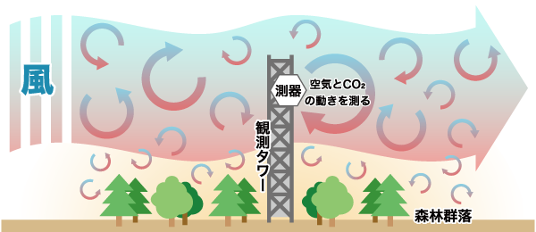
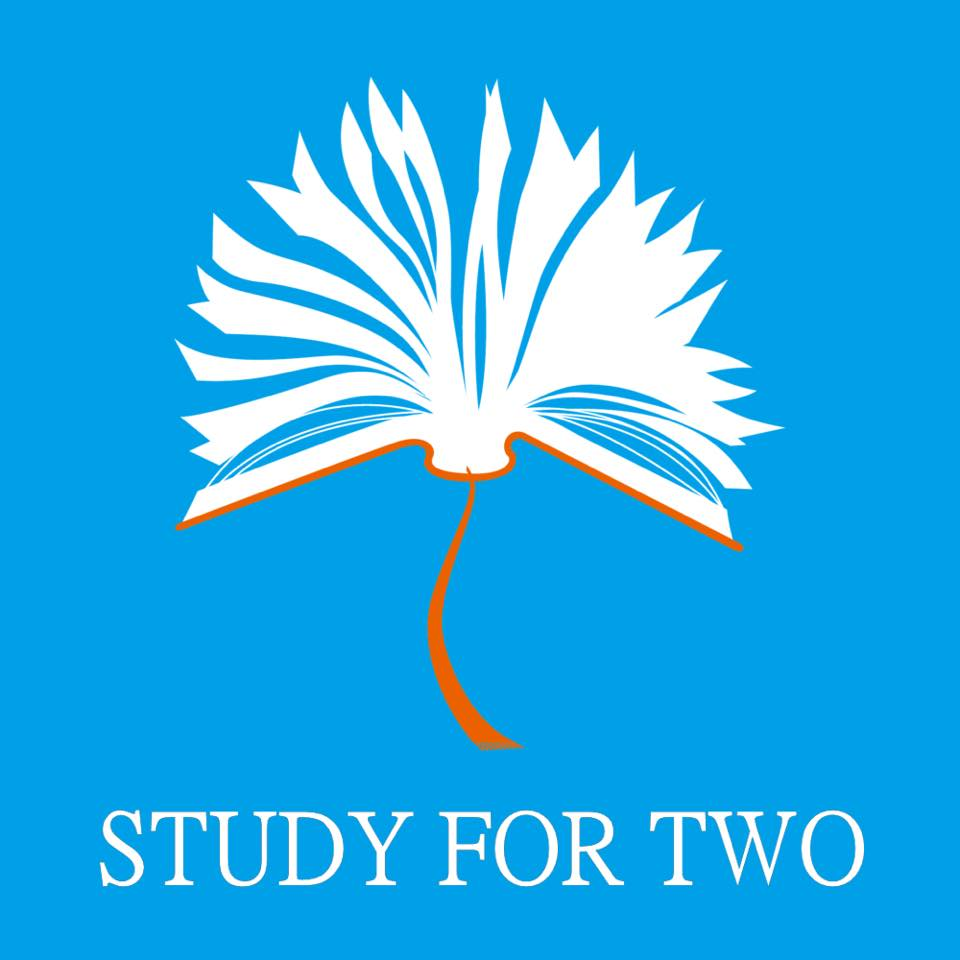
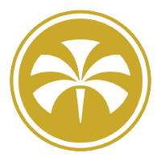
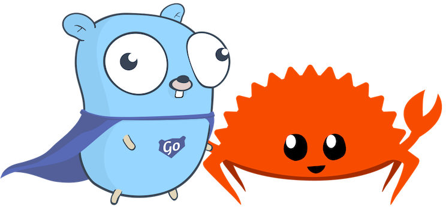
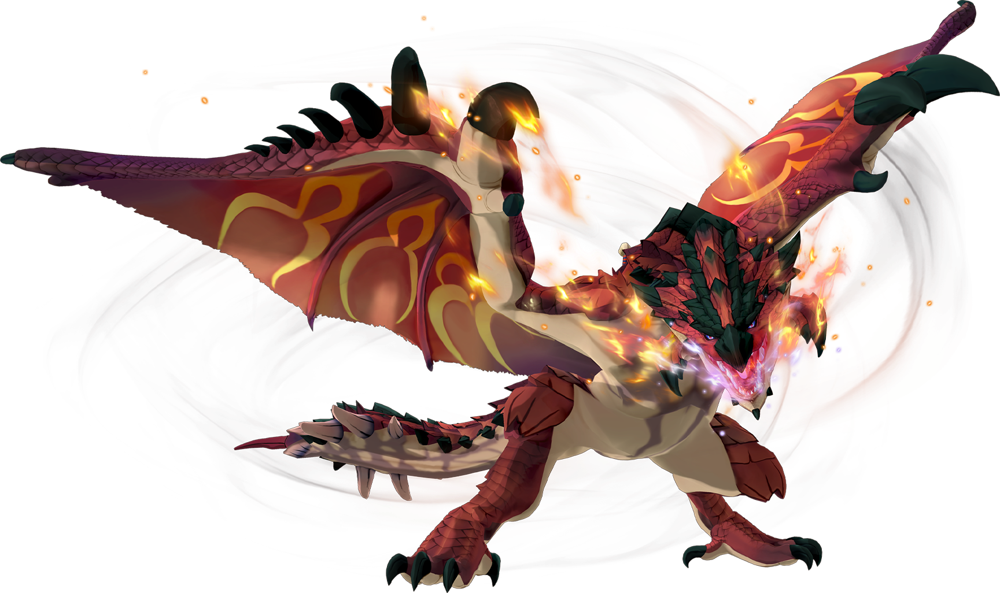
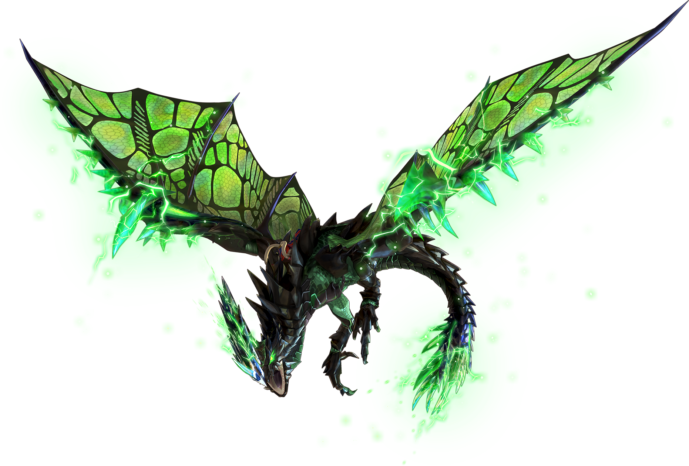
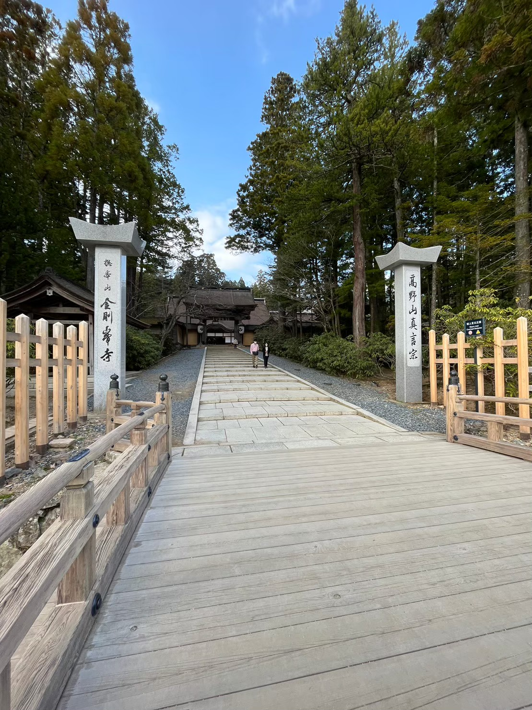
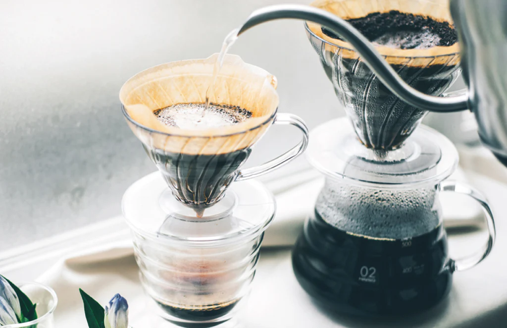

<!-- _class: title-slide -->

# 25卒LT会

中岡暉

---

## 自己紹介

- 名前：中岡暉（なかおかあきら）
- 出身：大阪府高槻市
- 所属：DIGITALIO Tech Unit ユーザーチーム
- 経歴：大阪府立大学 生命環境科学域 緑地環境科学類

  

---

## 専攻

- 大学では農学を専攻
- 研究は気象学
  - CH4とC2H6を測定

  

https://www.cger.nies.go.jp/cgernews/201204/257003.html

---

## 課外活動

- ボランティア団体で活動
  - 中古教科書の回収・再販売
  - 予約サイトや在庫管理システムを立ち上げ
- 大学の情報戦略課でシステム開発のバイトも
  - GoでPHPシステムのリプレイスなど

  
  
https://github.com/study-for-two

  
  
https://github.com/omu-sp

---

## 好きな技術

- TypeScript、PHP、Go、Pythonとかは触れます
- Rustもやりたい

  

https://bitfieldconsulting.com/posts/rust-and-go

---

## 趣味-1

- モンスターハンター
  - PS2以外で出たやつは大体やってる
    - P,P2(G),P3,3(G),4(G),X(X),W(I),Rise(SB),Wilds,F
  - シリーズ通算10,000時間↑

  
  

https://www.monsterhunter.com/stories2/ja/monster/

---

## 趣味-2

- ドライブ
  - 大学の同期と小旅行に行くのが年2〜3回の楽しみ

  
  

  

---

## 趣味-3

- コーヒー
  - 豆の種類とか焙煎の知識まで知れると面白そう
  - 最近はピーチティーっぽい香りがする豆を買った

  

https://shop.hariocorp.co.jp/collections/dripper

---

## やりたいこと-1

- 運動習慣をつけたい
  - 部活経験：空手・剣道
  - カジュアルなスポーツがやりたい
  - 最近ボルダリングをちょくちょくやってる

---

## やりたいこと-2

- 仕事はもろもろ頑張る
  - 足りていない知識や経験は積極的に取りに行く
  - 手を動かすだけでなく、座学も大事に

---

## おわりに

これからよろしくお願いします！

